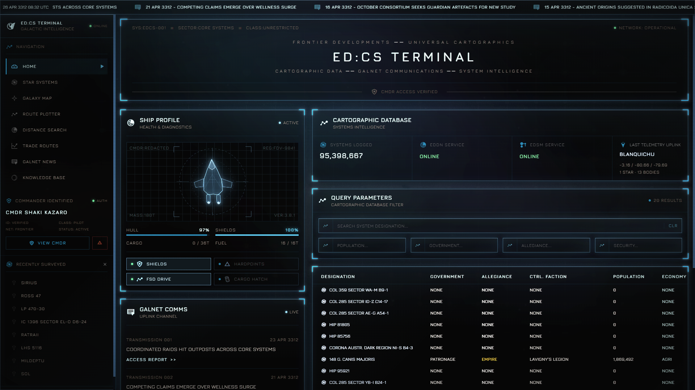

# ED:CS



## Development

ED:CS is built with [nextJS](https://nextjs.org/) and [Typescript](https://www.typescriptlang.org/).


## Requirements

- ED:CS backend services: https://github.com/sentrychris/edcs.

### Quick Start

Clone this repository:
```sh
git clone git@github.com:sentrychris/edcs-app.git
```

Copy `.env.example` to `.env` and update you environment variables:
```sh
cp .env.example .env
```

Run the development server
```sh
npm run dev
```

Build a production-ready release
```sh
npm run build
```

Run a production-ready release
```sh
npm start
```

### Credits

ED:CS wouldn't be possible without the work of hundreds of talented members of the Elite: Dangerous community.

_"Standing on the shoulders of giants"_.

Special thanks to:

- [ED:CD](https://edcd.github.io/)  - for all of their projects, data, guidance and more.
- [EDSM](https://github.com/EDSM-NET) - for the wonderful data and API.
- [Spansh](https://www.spansh.co.uk) - for the wonderful data and API.
- [iaincollinnns/icarus](https://github.com/iaincollins/icarus) - for UI inspiration, through his fantastic app - fonts and icons.
- [James Panter](https://codepen.io/jpanter/pen/PWWQXK) - for the loader animation.

### Legal

"Elite", the Elite logo, the Elite: Dangerous logo, "Frontier" and the Frontier logo are registered trademarks of Frontier Developments plc. All rights reserved. All other trademarks and copyrights are acknowledged as the property of their respective owners.

Site assets are used in accordance with their respective licensing conditions or with the owner's permission, third party licenses can be found [here](./THIRD_PARTY_LICENSES).

ED:CS is free, open source software released under the ISC License.